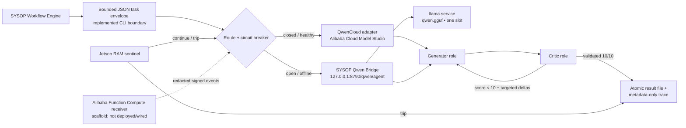

# ConglomerAIte architecture blueprint

## Decision summary

ConglomerAIte ships as an edge-first CLI accepting a bounded JSON task envelope. Qwen on Alibaba Cloud Model Studio is the primary backend; on the observed Nano, degraded calls use the existing advisory-only SYSOP Qwen Bridge at `127.0.0.1:8790`, which maps Generator to `agency_ai_engineer` and Critic/repair to `agency_code_reviewer` before reaching the one-slot `llama.service`. Direct task dispatch from the wider SYSOP Workflow Engine remains deployment integration. Generator and Critic are logical roles, not two resident edge models, so the 8 GB Nano never duplicates weights or KV caches.

The design targets Track 5 (EdgeAgent) through offline continuation and hardware-aware termination, and Track 3 (Agent Society) through explicit agent roles, per-run evidence, adversarial review, and autonomous refinement. It does **not** claim that a particular local GGUF, context size, or systemd limit is safe until that exact combination has been measured on the target Nano.

### What is implemented versus proposed

The repository implements the bounded Generator/Critic cycle, strict score parsing/10-with-no-blockers gate, best-candidate return, cloud-to-local routing, truncation rejection, rubric-stable refinement, a native SYSOP bridge provider, elapsed/iteration/stagnation bounds, and RAM checks from tegrastats, `/proc/meminfo`, finite cgroup limits, plus optional NVML. Direct SYSOP task dispatch, durable ledger/resume, thermal and swap-growth guards, adaptive context shrinking, and signed remote policy remain production extensions. A signed, metadata-only Alibaba Function Compute receiver is included as an undeployed scaffold.



## Task and result contracts

The current CLI accepts a JSON task file containing `task`, optional `rubric`, and per-task `cloud_allowed`. A direct SYSOP dispatcher should add a richer versioned envelope containing:

- `task_id`, `schema_version`, `created_at`, and an idempotency key;
- the user objective and acceptance rubric;
- data-residency classification and whether cloud use is permitted;
- deadline, maximum rounds, token budget, and local context budget;
- the last committed round when resuming an interrupted workflow.

The production extension should append an immutable ledger entry for each round containing route (`qwen_cloud` or `local_edge`), model identifier, prompt-template version, elapsed time, token counts when reported, Critic score, refinement deltas, memory sample, stop reason, and a hash of the candidate. API keys and raw sensitive prompts must never enter this ledger. Commit each entry atomically (SQLite transaction or write-then-rename) before the next call so a reboot can resume from the last complete round without replay ambiguity. The reference implementation currently returns this evidence in memory/JSON for one bounded process; it does not yet implement durable resume.

The terminal result returns the best candidate seen, not merely the last one, plus one of these stable stop reasons: `consensus_10`, `max_iterations`, `deadline`, `memory_guard`, `thermal_guard`, `provider_unavailable`, `stagnation`, or `cancelled`. A circuit-breaker exit is therefore a bounded, inspectable result rather than a fabricated 10/10.

## Routing and graceful degradation

The Qwen adapter defaults to `https://dashscope-intl.aliyuncs.com/compatible-mode/v1`; the provider appends `/chat/completions`. Portable development defaults to direct llama.cpp at `http://127.0.0.1:8080/v1`. The target systemd example instead uses `kind=sysop_bridge` and `http://127.0.0.1:8790`, preserving the deployed bridge's role routing and security contract. Endpoints and models remain configuration values. The cloud API key is injected through `QWEN_API_KEY` or `DASHSCOPE_API_KEY`, never JSON or source control.

The route controller is a three-state circuit breaker:

1. **Cloud primary (closed).** Use QwenCloud while cloud use is allowed and the deadline can accommodate the call. Use short connect timeouts, a bounded overall timeout, and at most a small jittered retry budget.
2. **Edge degraded (open).** Transport failures, timeouts, repeated 429/5xx responses, an operator offline flag, or loss of network open the breaker. In-memory round state is retained and the next logical call is sent to the configured local provider. On the observed Nano this is the SYSOP bridge, which already serializes local inference and applies a smaller output budget.
3. **Recovery probe (half-open).** After a cooldown, permit one cloud probe; close only after a successful, schema-valid response. A failed probe reopens the breaker without interrupting the local round.

Authentication and malformed-request errors are configuration defects, not transient network errors. They should raise a visible alert and may use the local backend only as an explicitly recorded degraded route; they must not trigger unbounded retries. Provider responses are accepted only after schema and task-ID validation. TLS verification remains enabled for the cloud path, and the local endpoint binds to loopback.

No boot-time dependency on QwenCloud is required. The orchestrator can start offline, and failure of the SYSOP bridge/local model is returned as a bounded provider failure. The direct SYSOP task dispatcher must consume that terminal result explicitly.

## The autonomous 10/10 loop

For round zero, Generator receives the original objective, rubric, and constraints. On later rounds it also receives the previous candidate and only the Critic's actionable deltas. Critic receives the immutable objective/rubric plus the candidate; it must return a score and concrete defects. Keeping the original rubric in every Critic prompt reduces refinement drift.

`10/10` is accepted only when all of the following hold:

- the score is explicitly parseable and in the inclusive range 0–10;
- every required rubric item is marked satisfied;
- no critical defect or safety violation remains;
- the candidate is newer than the last rejected candidate.

Structured JSON is the preferred Critic contract, with tolerant extraction of text such as `8/10` as a compatibility fallback. A parse failure consumes a bounded Critic-repair attempt, not a Generator round. The loop terminates at 10/10, at its iteration/deadline/stagnation bounds, or immediately when the hardware sentinel trips. A non-10 termination still returns the highest-scoring valid candidate and all unresolved deltas.

The roles run sequentially on edge. They may use different Qwen cloud models or temperatures in cloud mode, but the local mode uses one resident quantized model with role-specific system prompts. This is a multi-agent deliberation protocol without pretending the Nano can safely host multiple simultaneous large-model processes.

## Jetson hardware safety

Jetson Orin Nano has unified CPU/GPU DRAM. NVML-style `memory.used` is not a reliable standalone measure of available GPU headroom on Jetson, and NVML may be absent entirely. The current tegrastats parser extracts RAM used/total only, supplemented by `/proc/meminfo` and finite cgroup counters. Parsing swap, temperature, power, `memory.events`, and PSI remains production work. NVML can be an optional signal on discrete-GPU development machines, never a Jetson requirement.

The reference sentinel checks RAM pressure before and after every Generator or Critic call using tegrastats, `/proc/meminfo`, and finite cgroup memory limits, with NVML as an optional supplemental probe. A production-hardened sentinel should additionally check:

- temperature and swap-growth thresholds;
- elapsed time, loop count, and cancellation state.

When a pre-call sample already exceeds the hard RAM threshold, the current guard refuses to schedule that provider call and returns a circuit-breaker result; its post-call check can stop the following call. It cannot predict or prevent a sudden allocation failure inside an active CUDA/model call. Adaptive soft-threshold context/output reduction, thermal/swap termination, and stable split stop reasons such as `thermal_guard` are recommended next steps. Memory charged to `llama-safe.service` is bounded by its cgroup where kernel accounting applies, but GPU-driver/global OOM paths can still occur.

The shipped systemd numbers are conservative starting points, not reservations and not proof of fit. `MemoryMax` limits memory charged to the userspace cgroup; it does not reserve RAM for the OS and may not account for every GPU-driver allocation or carveout. Because the GPU shares system DRAM, the application-level telemetry/circuit breaker remains mandatory even with systemd limits. NVMe swap can improve recoverability for cold CPU pages, but CUDA allocations and a growing KV cache cannot be made safe by swap.

An optional local-model benchmark candidate is `unsloth/Qwen3.5-4B-GGUF` at Q4_K_M or smaller. Pin an exact artifact and SHA-256, use bounded context, and benchmark one request at a time. Do not have the service download or silently replace model files at startup.

## Service isolation

The deployment supplies:

- `conglomeraite.slice`, an aggregate ceiling for the orchestrator and model;
- `conglomeraite@.service`, a bounded one-shot task instance reading `/var/lib/conglomeraite/tasks/%i.json`;
- a drop-in for the existing `llama-safe.service` rather than a replacement unit.

The orchestrator receives a small cap and a negative `OOMScoreAdjust`, increasing—but not guaranteeing—the chance it survives long enough to persist an error result when the model is killed. The model receives the larger cap and `OOMScoreAdjust=500`, biasing global OOM victim selection toward it. `MemoryHigh` requests reclaim/throttling before `MemoryMax`; neither is guaranteed to cover every Jetson GPU allocation. `MemorySwapMax` bounds charged swap, and start limits bound rapid restart storms. Exact values should be adjusted from p95 measurements with at least 1.5–2 GB of observed host headroom during the worst prompt.

An operator—or the future SYSOP adapter—launches a task with a filesystem-safe ID:

```bash
sudo install -o conglomeraite -g conglomeraite -m 0640 task-42.json \
  /var/lib/conglomeraite/tasks/task-42.json
sudo systemctl start conglomeraite@task-42.service
journalctl -u conglomeraite@task-42.service -f
```

## Alibaba-hosted backend proof

Using a Qwen model name alone is not evidence that inference ran on Alibaba Cloud. The demo should retain a redacted proof bundle per run: configured DashScope international endpoint, model ID, timestamps, request/correlation IDs exposed by the provider, route transitions, and the corresponding Model Studio usage view or bill screenshot. Never expose the API key or full sensitive payload.

The repository includes `cloud/alibaba-telemetry/`, a minimal Function Compute HTTP receiver that verifies timestamped HMAC signatures, rejects unknown/content-bearing fields, and logs accepted metadata. It is a scaffold only: it is not deployed, not wired to the edge loop, and does not yet provide a dashboard, durable store, replay database, or signed policy distribution. Inference and safety decisions remain local when disconnected. A real Function Compute deployment, invocation logs, and screenshots are still required to close the hosted-backend proof gap.

## Evaluation plan: prove the gains

Claims should come from an identical, seeded task corpus evaluated in four modes: single-agent cloud, Generator/Critic cloud, single-agent edge, and Generator/Critic edge. Add a deterministic network-drop injection between rounds and at least one memory-pressure test. Report:

- rubric score and first-pass/terminal 10/10 rate, with judge or held-out evaluator confirmation;
- tokens, calls, wall time, and joules per accepted answer (use `tegrastats` power data when available);
- p50/p95 peak RAM, swap growth, and circuit-breaker trips;
- recovery success, lost-work count, and time to useful degraded result;
- regression rate: cases where refinement lowers an external evaluator score.

The efficiency claim should be framed as quality per token/joule or human-accepted result per minute, not simply fewer calls—the refinement loop intentionally makes more calls. Store the raw JSONL/CSV and the exact model artifacts/configuration in `artifacts/` so judges can reproduce every chart.

## Failure-mode matrix

| Failure | Detection | Automatic action | Evidence |
|---|---|---|---|
| Wi-Fi/network loss | connect timeout/transport error | open cloud breaker; continue next role locally | route transition + uninterrupted task ID |
| Qwen 429/5xx | classified status and failure count | bounded jitter; then local route | status class, retry count, latency |
| Bad API key/request | 401/403/4xx schema error | alert; explicitly marked local degradation | stable error code, no secret |
| Critic output malformed | JSON validation then score parser | one bounded repair prompt | raw hash + parse error |
| Score stagnates | unchanged candidate/score/deltas | return best candidate with `stagnation` | candidate hashes and scores |
| Memory pressure | tegrastats/proc/cgroup RAM sentinel | current: stop scheduling; proposed: shrink budget | RAM sample + stop reason |
| Model cgroup OOM | systemd result and operator inspection of `memory.events` | stop/restart model within start limit; orchestrator survival not guaranteed | journal and cgroup event |
| Reboot/process loss (proposed) | incomplete durable task ledger | future: resume last committed round | task ID + last round |

## Security and observability baseline

Run the orchestrator as an unprivileged dedicated user with a read-only application tree, minimal writable state paths, no Linux capabilities, loopback-only model access, and systemd hardening. Keep API credentials in a root-managed environment file or credential store. Use structured journal events with stable event names, task/correlation IDs, route, score, stop reason, latency, and redacted resource telemetry. Alert on repeated cloud-breaker opens, model OOM/start-limit hits, missing required memory telemetry, and tasks that terminate without a valid candidate.
